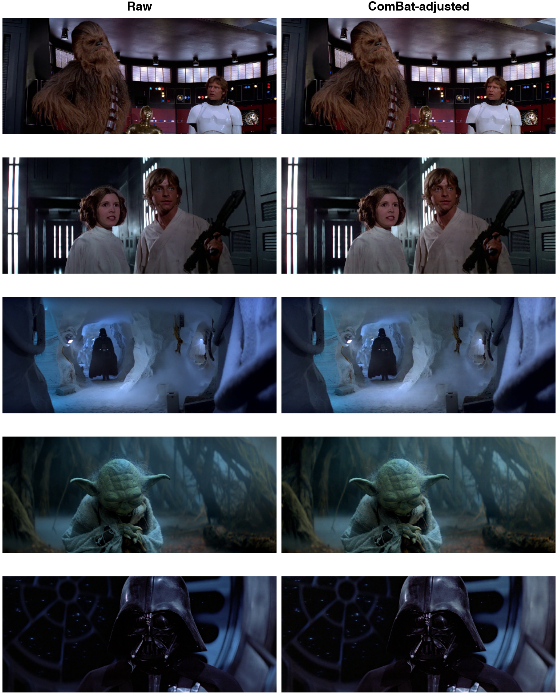
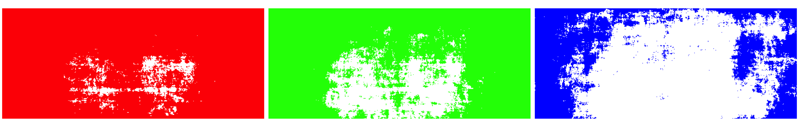
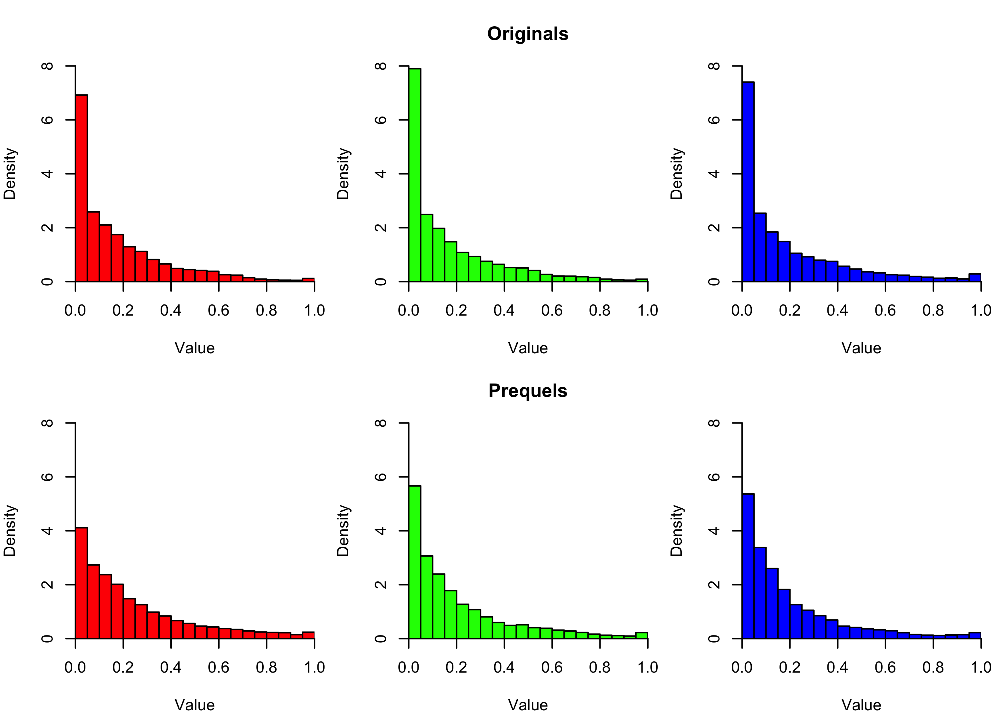

# Correcting for Batch Effects in the Star Wars Trilogies

Have you ever wanted to treat Star Wars like a microarray experiment? I have, and one day I decided to go through with it. 

This repository contains code for running the batch-correction method [ComBat](https://www.bu.edu/jlab/wp-assets/ComBat/Abstract.html) on the Star Wars trilogies.  

### Colour Spectrum

